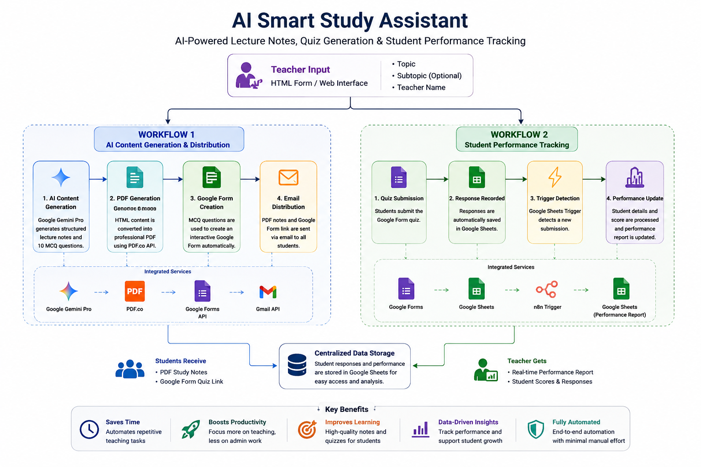
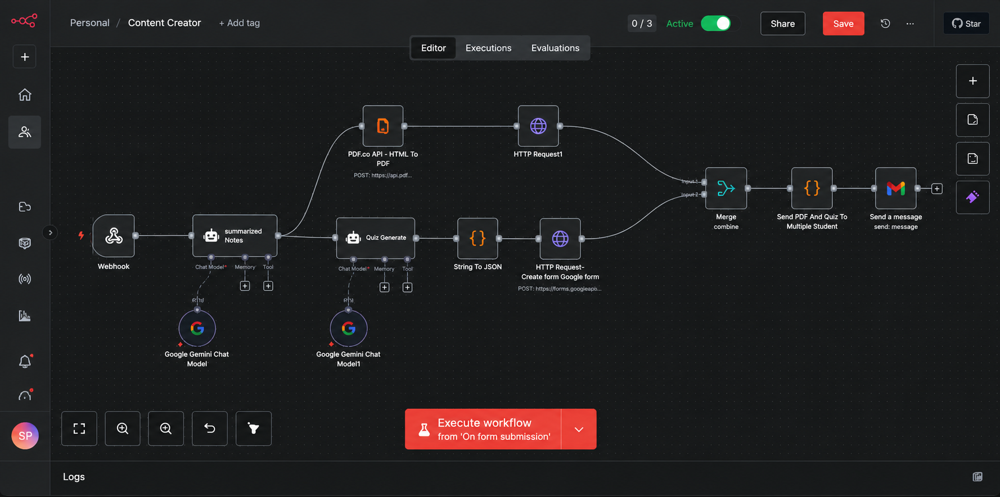
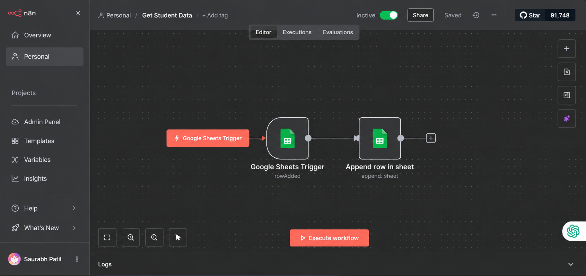
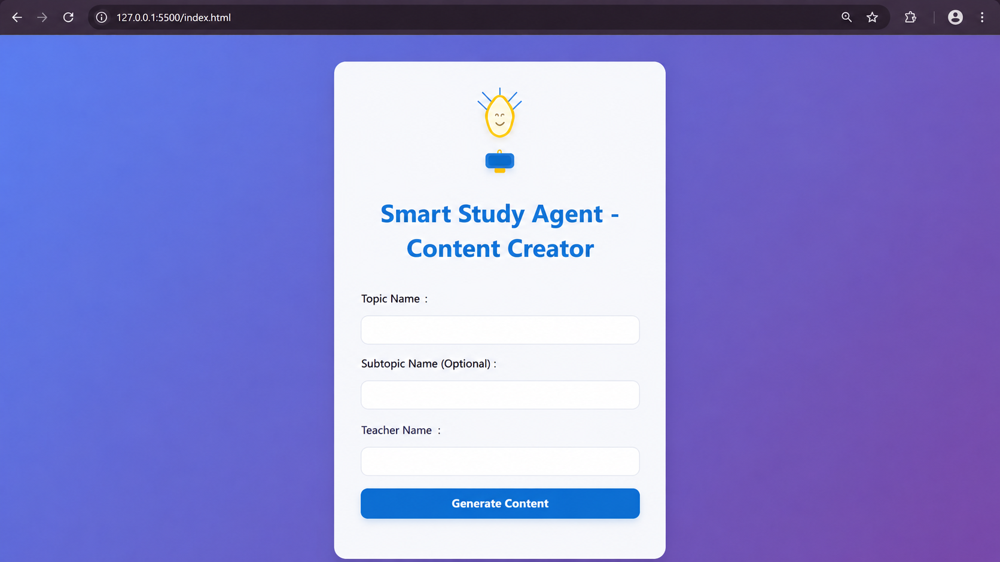
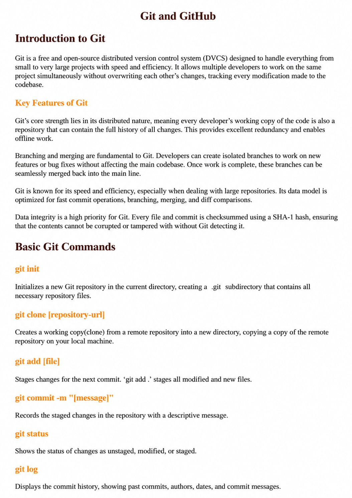
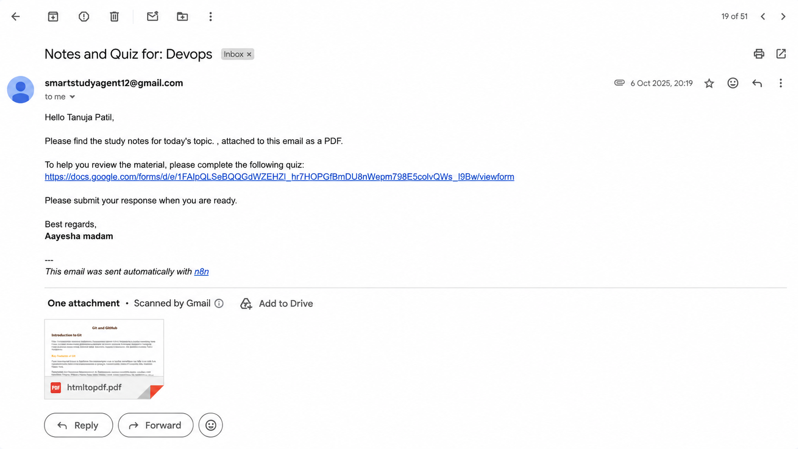
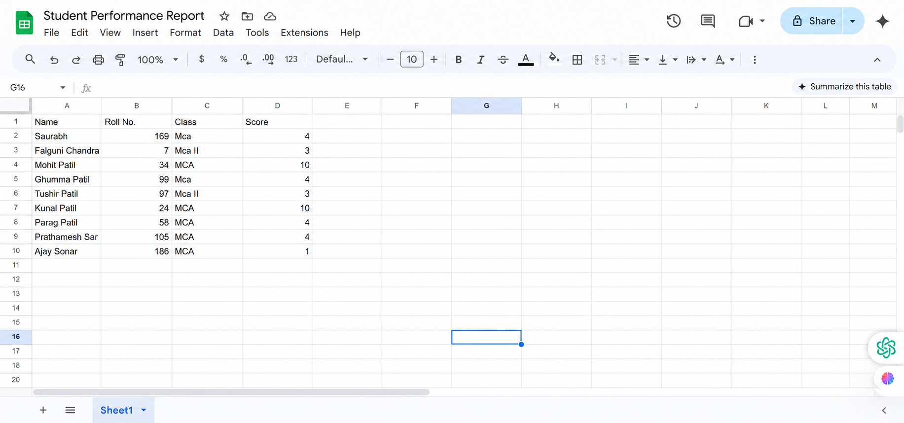

# 📚 AI Smart Study Assistant

### AI-Powered Lecture Notes, Quiz Generation & Student Performance Tracking

An AI-powered workflow automation system that transforms a lecture topic into structured study notes, professional PDF materials, interactive Google Form quizzes, and automatically distributes them to students while tracking their quiz performance—all through an intelligent n8n workflow.

🤖 <strong>Google Gemini Pro</strong> • ⚙️ <strong>n8n</strong> • 📄 <strong>PDF.co</strong> • 📋 <strong>Google Forms</strong> • 📧 <strong>Gmail</strong>

---

## 📑 Table of Contents

- [✨ Project Highlights](#-project-highlights)
- [🚀 Project Overview](#-project-overview)
- [🎯 Problem Statement](#-problem-statement)
- [💡 Solution](#-solution)
- [🏗️ System Architecture](#️-system-architecture)
- [🛠️ Technology Stack](#️-technology-stack)
- [⚙️ How the System Works](#️-how-the-system-works)
- [🤖 AI Content Generation & Distribution](#-ai-content-generation--distribution)
- [📊 Student Performance Tracking](#-student-performance-tracking)
- [📸 Project Outputs](#-project-outputs)
- [🎯 Real-World Use Case](#-real-world-use-case)
- [🚧 Challenges Faced](#-challenges-faced)
- [🚀 Future Enhancements](#-future-enhancements)
- [🎓 Key Learnings](#-key-learnings)
- [👨‍💻 Author](#-author)
- [📄 License](#-license)
- [⭐ Support](#-support)

---

## ✨ Project Highlights

- 🤖 AI-powered lecture note generation using Google Gemini Pro
- 📝 Automatic quiz generation from AI-generated study notes
- 📄 Professional PDF creation using PDF.co
- 📋 Dynamic Google Form quiz creation
- 📧 Automatic email distribution to students
- 📊 Automated student performance tracking
- ⚡ Fully automated workflow built using n8n
- 🔄 End-to-end educational workflow automation

---

## 🚀 Project Overview

AI Smart Study Assistant is an end-to-end educational workflow automation system designed to simplify how teachers prepare and distribute learning materials.

Instead of manually writing lecture notes, creating quizzes, formatting PDFs, building Google Forms, sending emails, and tracking student performance, teachers only need to provide a lecture topic and an optional subtopic.

The system automatically generates AI-powered study materials, converts them into a professional PDF, creates a Google Form quiz, emails the materials to students, and tracks quiz performance through a dedicated reporting workflow.

By combining Artificial Intelligence, workflow automation, and cloud services, the project significantly reduces repetitive manual work while delivering consistent, high-quality learning resources.

---

## 🎯 Problem Statement

Creating and distributing educational content is a repetitive and time-consuming process for educators. After every lecture, teachers often need to prepare study notes, create quizzes, convert documents into PDFs, distribute learning materials to students, and manually monitor quiz performance.

As the number of students increases, these repetitive tasks become difficult to manage and reduce the time educators can dedicate to teaching and student interaction.

Some of the common challenges include:

- ⏳ Time-consuming preparation of lecture notes
- 📝 Manual quiz creation for every topic
- 📄 Formatting notes into shareable PDF documents
- 📧 Sending study materials individually to students
- 📋 Creating online quizzes manually
- 📊 Tracking student performance and quiz responses
- 🔁 Repeating the same workflow for every lecture

These challenges highlight the need for an intelligent automation system that can generate, distribute, and track educational content with minimal manual effort.

---

## 💡 Solution

AI Smart Study Assistant automates the complete educational content creation and distribution process using Artificial Intelligence and workflow automation.

Teachers simply provide a lecture **topic** along with an optional **subtopic**, and the system automatically performs every remaining task.

The workflow intelligently:

- 🤖 Generates AI-powered lecture notes using Google Gemini Pro
- 📄 Converts notes into a professional PDF document
- 📝 Creates a multiple-choice quiz from the generated notes
- 📋 Builds an interactive Google Form automatically
- 📧 Sends personalized emails containing the PDF and quiz link to students
- 📊 Tracks student quiz submissions through a dedicated automation workflow
- 📈 Generates an organized performance report for teachers

The entire process is orchestrated using **n8n**, allowing multiple cloud services and AI capabilities to work together seamlessly without requiring manual intervention.

---

## 🏗️ System Architecture

The Smart Study Assistant follows a modular, event-driven architecture where **n8n** acts as the central orchestration engine, coordinating AI services, cloud applications, and automation workflows.

The system is divided into two independent workflows:

### 🤖 Workflow 1 — AI Content Generation & Distribution

Responsible for generating study materials, creating quizzes, producing PDF notes, and distributing them to students.

### 📊 Workflow 2 — Student Performance Tracking

Monitors Google Form submissions and automatically updates a centralized student performance report.

  

---

## 🛠️ Technology Stack

The AI Smart Study Assistant combines Artificial Intelligence, workflow automation, and cloud services to automate the complete educational content lifecycle.

| Technology | Purpose |
|------------|---------|
| **n8n** | Central workflow automation platform that orchestrates the complete system. |
| **Google Gemini Pro** | Generates AI-powered lecture summaries and quiz questions. |
| **PDF.co API** | Converts AI-generated HTML content into professionally formatted PDF documents. |
| **Google Forms API** | Automatically creates interactive quizzes from AI-generated questions. |
| **Google Sheets** | Stores quiz responses and maintains student performance reports. |
| **Google Sheets Trigger** | Detects new quiz submissions and starts the performance tracking workflow. |
| **Gmail** | Automatically distributes study materials and quiz links to students. |
| **JavaScript (n8n Code Node)** | Transforms JSON data, prepares email payloads, and processes workflow logic. |
| **HTTP Request Node** | Integrates external APIs such as PDF.co and Google Forms. |

---

## ⚙️ How the System Works

The Smart Study Assistant is built around two independent yet connected automation workflows.

The first workflow focuses on **content generation and distribution**, where Artificial Intelligence creates educational resources and automatically delivers them to students.

The second workflow focuses on **student performance tracking**, where every quiz submission is automatically recorded and transformed into a structured performance report for educators.

Together, these workflows automate the complete educational lifecycle—from creating learning materials to monitoring student progress.

---

## 🤖 AI Content Generation & Distribution

This is the primary workflow responsible for creating and distributing educational materials.

The process begins when a teacher submits a lecture **topic** and an optional **subtopic** through a simple HTML form.

The workflow then performs the following tasks automatically:

1. Generates structured lecture notes using **Google Gemini Pro**.
2. Creates multiple-choice quiz questions based on the generated notes.
3. Converts the lecture notes into a professionally formatted PDF using **PDF.co**.
4. Creates an interactive Google Form quiz automatically.
5. Merges the generated PDF and quiz link into a single output.
6. Sends personalized emails containing the study notes and quiz link to every student.

This entire workflow executes automatically without requiring any manual intervention after the teacher submits the topic.

  

---

## 📊 Student Performance Tracking

A dedicated secondary workflow continuously monitors student quiz submissions.

Whenever a student completes the Google Form quiz:

1. Google Forms records the response in Google Sheets.
2. A Google Sheets Trigger automatically detects the newly submitted response.
3. The workflow extracts the student's information and quiz score.
4. A structured performance report is automatically updated.
5. Teachers can review student performance without manually collecting or organizing quiz results.

This workflow closes the learning feedback loop by providing educators with organized and up-to-date assessment data.

  

---

## 📸 Project Outputs

The following screenshots showcase the complete journey of the Smart Study Assistant—from teacher input to automated content generation, quiz creation, student distribution, and performance tracking.

---

### 📝 HTML Input Form

Teachers begin by entering the lecture **topic**, an optional **subtopic**, and the **teacher's name** through a simple web interface.

  

---

### 📄 AI-Generated Study Notes (PDF)

The workflow converts AI-generated lecture notes into a professionally formatted PDF that is ready to share with students.

  

---

### 📋 AI-Generated Google Form Quiz

Based on the generated lecture notes, the system automatically creates a Google Forms quiz containing multiple-choice questions for student assessment.

  

---

### 📧 Automated Student Email

Every student automatically receives a personalized email containing:

- 📄 Lecture Notes (PDF)
- 📋 Google Form Quiz Link

  

---

### 📊 Student Performance Report

After students submit the quiz, a dedicated workflow automatically records their responses and generates an organized performance report in Google Sheets.

  

---

## 🎯 Real-World Use Case

Imagine a teacher wants to prepare study material for the topic **Cloud Computing**.

Instead of spending hours writing notes, creating quizzes, formatting PDFs, building Google Forms, emailing students, and tracking quiz responses manually, the teacher simply enters the topic and optional subtopic into the Smart Study Assistant.

The system automatically:

- 🤖 Generates AI-powered lecture notes
- 📄 Creates a professional PDF document
- 📝 Builds an interactive Google Form quiz
- 📧 Sends study materials to every student
- 📊 Tracks quiz submissions automatically
- 📈 Maintains a centralized student performance report

What traditionally takes hours of manual effort is completed within minutes through a fully automated workflow.

---

## 🚧 Challenges Faced

Developing the Smart Study Assistant required integrating multiple AI services, APIs, and automation workflows into a reliable end-to-end system.

Some of the key challenges included:

### 🤖 AI Response Formatting

Ensuring that AI-generated lecture notes and quiz questions followed a structured format suitable for downstream automation.

---

### 📋 Dynamic Google Form Creation

Transforming AI-generated quiz content into a structured JSON format compatible with the Google Forms API.

---

### 📄 PDF Generation

Converting AI-generated HTML content into professionally formatted PDF documents while preserving readability and layout.

---

### 🔄 Workflow Synchronization

Managing parallel workflow execution so that both the generated PDF and quiz link were available before sending emails.

---

### 📧 Automated Distribution

Preparing personalized emails containing both PDF attachments and quiz links for multiple students.

---

### 📊 Performance Tracking

Designing a separate automation workflow that continuously monitors quiz submissions and updates student performance reports automatically.

---

## 🚀 Future Enhancements

The Smart Study Assistant has been designed with scalability in mind. Future improvements that can further enhance the system include:

- 🌍 Multi-language support for study notes and quizzes.
- 🎙️ Voice-based topic input using speech-to-text.
- 📱 WhatsApp and Telegram integration for instant student notifications.
- 📊 Interactive dashboard for visualizing student performance analytics.
- ☁️ Automatic storage of generated study materials in Google Drive.
- 🧠 Support for multiple AI models such as OpenAI GPT, Claude, and Llama.
- 🎨 AI-generated presentation slides from lecture notes.
- 🔐 Teacher authentication and role-based access control.
- 📚 Student portal for accessing previous study materials and quiz history.

---

## 🎓 Key Learnings

Building the AI Smart Study Assistant provided hands-on experience in designing and integrating AI-powered automation workflows.

Through this project, I gained practical experience with:

- 🤖 AI-powered content generation using Google Gemini Pro.
- ⚙️ End-to-end workflow automation with n8n.
- 🔗 REST API integration using HTTP Request nodes.
- 📋 Dynamic Google Forms creation through APIs.
- 📄 HTML-to-PDF conversion using PDF.co.
- 📊 Automated student performance tracking with Google Sheets.
- 📧 Email automation using Gmail.
- 🧩 Workflow branching, synchronization, and data transformation.
- 💻 JavaScript for JSON processing and workflow customization.
- 🏗️ Designing scalable AI-powered educational automation systems.

---

## 👨‍💻 Author

**Saurabh A. Patil**

MCA Student | AI Automation & Generative AI Enthusiast

I enjoy building AI-powered automation systems that solve real-world problems by combining Large Language Models (LLMs), workflow automation, APIs, and cloud technologies.

### 📬 Connect with Me

- 💼 LinkedIn: https://www.linkedin.com/in/YOUR-LINKEDIN
- 🐙 GitHub: https://github.com/YOUR-USERNAME

---

## 📄 License

This project is licensed under the **MIT License**.

You are welcome to explore this repository for learning and inspiration.

---

## ⭐ Support

If you found this project helpful or interesting, consider giving it a ⭐ on GitHub. Your support motivates me to continue building AI-powered automation projects and sharing them with the developer community.
